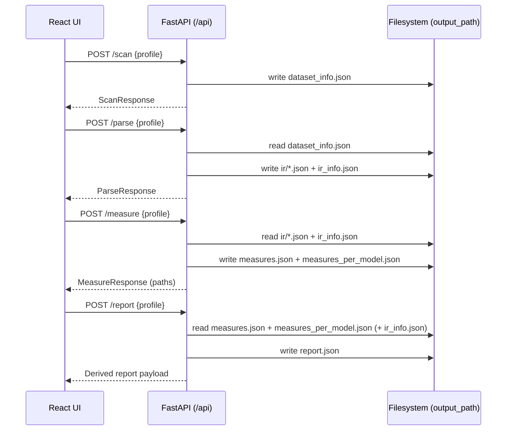

# Pipeline Stages (Section 5.2) — Scan → Parse → Measure → Report

This document describes the implemented pipeline (stages, inputs/outputs, and artifact flow) for the CM-Benchmarking prototype.

---

## 0) One-Line Summary

Given a dataset directory, the pipeline:

**Scan** files → **Parse** to normalized IR → **Measure** dataset/model metrics → **Report** derives UI-ready payload.

---

## 1) End-to-End Flow (Artifacts)

```mermaid
flowchart TD
  D[(Dataset directory\nscan.dataset_path)]

  P[Benchmark profile JSON\n(name, output_path, scan, parse, measure)]

  S1[Stage 1: Scan\ncmbenchmark/services/scan.py]
  A1[dataset_info.json]

  S2[Stage 2: Parse\ncmbenchmark/services/parse.py]
  A2a[ir/ (IR JSON files)]
  A2b[ir_info.json]

  S3[Stage 3: Measure\ncmbenchmark/services/measure.py]
  A3a[measures.json]
  A3b[measures_per_model.json]

  S4[Stage 4: Report\ncmbenchmark/services/report.py]
  A4[report.json (derived UI payload)]

  P --> S1
  D --> S1
  S1 --> A1

  P --> S2
  A1 --> S2
  S2 --> A2a
  S2 --> A2b

  P --> S3
  A2a --> S3
  A2b --> S3
  S3 --> A3a
  S3 --> A3b

  P --> S4
  A3a --> S4
  A3b --> S4
  A2b -. optional .-> S4
  S4 --> A4
```

All artifacts are stored under `profile.output_path` (no DB).

---

## 2) Orchestration Modes

### 2.1 CLI orchestration (Typer)

- **Single stage**:
  - `cmbenchmark scan --profile <profile.json>`
  - `cmbenchmark parse --profile <profile.json>`
  - `cmbenchmark measure --profile <profile.json>`
  - `cmbenchmark report --profile <profile.json>`
- **Full pipeline**:
  - `cmbenchmark run --profile <profile.json>`

### 2.2 REST orchestration (FastAPI)

Frontend (or any client) orchestrates by calling:

- `POST /api/scan`
- `POST /api/parse`
- `POST /api/measure`
- `POST /api/report`

Request body: `{ "profile": <BenchmarkProfile JSON> }`

---

## 3) Stage 1 — SCAN

### Purpose

Identify candidate model files in the dataset directory and compute dataset-level scan diagnostics:

- counts by extension
- unreadable files
- “too large” files (optional threshold)
- duplicate groups (SHA256)
- final list of candidate relative paths

### Implementation

- `cmbenchmark/services/scan.py::scan_dataset(...)`
- Default include patterns (if profile does not specify `scan.include`):
  - `["*.xmi", "*.uml", "*.xml", "*.bpmn", "*.bpmn2", "*.ecore", "*.archimate"]`

### Inputs

- `profile.scan.dataset_path` (required)
- optional:
  - `profile.scan.include`: list of glob patterns
  - `profile.scan.exclude`: list of glob patterns
  - `profile.scan.size_limit_mb`: max source file size

### Core logic (high-level)

- recursively walk dataset directory
- filter by include/exclude patterns (matched against filename + relative path + absolute path)
- for candidates:
  - verify readable (read 1 byte)
  - check size against threshold
  - hash file contents (SHA256) for duplicate detection
- drop:
  - unreadable
  - too large
  - duplicates (keeps the lexicographically first path per duplicate group)

### Outputs (persisted)

`<output_path>/dataset_info.json` containing:

- `dataset_root` (absolute)
- `scanned_at` (UTC ISO string)
- `parameters` (include/exclude/size_limit)
- `totals` (counts: total_seen, candidates, unreadable, too_large, filtered)
- `extensions` (count by extension)
- `duplicates_groups` (members per hash group)
- `too_large`, `unreadable`, `filtered` (relative paths)
- `candidates` (relative paths; input for parse stage)

---

## 4) Stage 2 — PARSE

### Purpose

Convert each candidate source model into a normalized **Intermediate Representation (IR)**:

- graph-like IR (nodes + edges + metadata)
- capture parsing diagnostics (warnings/skips/time/file sizes)

### Implementation

- `cmbenchmark/services/parse.py::parse_from_scan(...)`
- Parser resolution:
  - registry in `cmbenchmark/parser/base.py`
  - selected via `profile.parse.parser_language`

### Implemented parser languages (registry keys)

- `UML`
- `ArchiMate-Archi`
- `ArchiMate-XML`
- `Ecore`

### Inputs

- `<output_path>/dataset_info.json` (must exist)
- `profile.parse.parser_language`

### Core logic (high-level)

For each candidate `relpath` in `dataset_info.candidates`:

- compute deterministic `file_id` = SHA256(file bytes)[:16]
- run parser with timing:
  - records warnings and “skipped element” events via `ParserRunStats`
- determine parse status:
  - `success`: no warnings and no skips
  - `warning`: elements loaded > 0, but warnings or skips exist
  - `failure`: no elements loaded or exception
- if IR exists:
  - attach IR metadata: `source_path`, `source_relpath`, `filesize`
  - save IR to `<output_path>/ir/<file_id>.json`

Operational note:

- `<output_path>/ir/` is **deleted and recreated** at parse start to avoid stale IR mixing.

### Outputs (persisted)

- directory: `<output_path>/ir/` (one JSON per successfully created IR)
- file: `<output_path>/ir_info.json` (dataset-level parse index + diagnostics)

`ir_info.json` contains:

- `index`: `ir_id -> relpath`
- `totals`: candidates_in, parsed_success, parsed_warning, parsed_failure
- `modelParseDiagnostics`: per `ir_id`:
  - `parse_status`
  - `parse_time_ms`
  - `elements_loaded`, `elements_skipped`
  - `warning_count`, `warnings_by_type`, `warning_msgs`
  - `file_size_bytes_source`, `file_size_bytes_ir`
  - optional `parse_error_msg`

---

## 5) Stage 3 — MEASURE

### Purpose

Compute quality/characterization measures from:

- IR files (`<output_path>/ir/*.json`)
- parse diagnostics (`ir_info.json`)
- measure configuration in the benchmark profile

### Implementation

- `cmbenchmark/services/measure.py::compute_measure(...)`
- Writes:
  - `<output_path>/measures.json`
  - `<output_path>/measures_per_model.json`

### Inputs

- IR directory (implicitly `<output_path>/ir/`)
- `ir_info.json` (must exist; required for parsing measures)
- `profile.measure.*` toggles

### Measure groups (implemented)

- **D1 Parsing measures** (from `ir_info.json`)
- **D2 Lexical measures** (optional; enabled by `profile.measure.lexical.enabled`)
- **D3 Construct measures** (optional; enabled when `profile.measure.constructs.enabled` is true)
  - uses construct definitions loaded by parser language (`cmbenchmark/construct_catalog.py`)
- **D4 Size & complexity measures** (optional; enabled by `profile.measure.size_complexity.enabled`)

### Outputs (persisted)

- `<output_path>/measures.json` (dataset-level results)
- `<output_path>/measures_per_model.json` (per-model results keyed by IR id)

These files are the **stable contract** for the final stage.

---

## 6) Stage 4 — REPORT (Derived UI Payload)

### Purpose

Transform measures (+ optional IR index) into a **UI-ready derived payload**:

- chart series
- histogram bins
- top-N tables (largest files, most warnings, etc.)
- enriched rows with `relpath` via `ir_info.index` where available

### Implementation

- `cmbenchmark/services/report.py::generate_report(...)`
- This stage is intentionally “derived” (mirrors frontend shaping logic, now centralized in Python).

### Inputs

- `<output_path>/measures.json`
- `<output_path>/measures_per_model.json`
- optional `<output_path>/ir_info.json` (if present, used to map model IDs → relpaths)

### Outputs (persisted + returned)

- persists `<output_path>/report.json`
- REST: `POST /api/report` returns the derived report JSON directly

Note:

- This implementation does **not** generate a separate `report.html` artifact; the Web UI renders the derived JSON.

---

## 7) Pipeline-in-the-UI (Web Workflow)

The SPA (`frontend/src/App.tsx`) enforces stage ordering:

- user loads a profile JSON
- UI calls stage endpoints in order
- after `measure`, UI requests `report` and renders charts/tables



